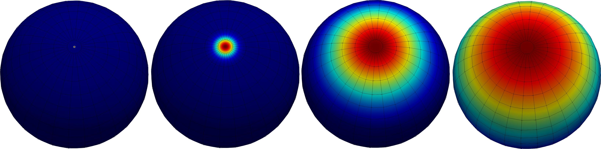
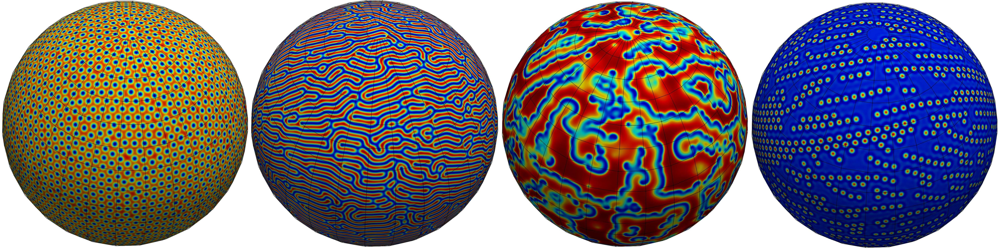

# SphereDiffProblem

Model for solving the linear diffusion equation over sphere surface.

You can find more information about the algorithm [here](https://www.sciencedirect.com/science/article/abs/pii/S0168927419300431).

## Features:
- Second order aproximation in time and space    
- Calculation parallelization using OpenMP
- Mass conservative
- Numerical squeme:
    - Crank Nicolson squeme (Unconditionally stable)
    - Implicit (no  iterations required)
    - L2 norm conservative

## How to run the program? 

### Create the `CMakeLists.txt` file 

    cp CMakeLists.txt_Diff CMakeLists.txt

### Compile the program

    mkdir build 
    cd build 
    cmake .. 
    make 

### Create the `namelist` file and the other input files

Go to the folder  `experiments/simple_diff/` and run the python scrip `exp.py`:
    
    cd experiments/simple_diff/
    python3 exp.py 

This script generates everything needed to run a simple example. You can use it as a reference for other cases. After that, you can run the program:
    
    cd build 
    ./diff.exe

## The Gray-Scott model
Use `CMakeLists.txt_GS` file:
    
    cp CMakeLists.txt_GS CMakeLists.txt 

and the script `experiments/gray_scott/exp.py` if you want to play with Gray-Scott model

## How to view the output?

Use the `python/convertToParaViewSingle.py` script to convert the output files to VTK format, then you can view the output using the [paraview](https://www.paraview.org/) program.

## Gallery

Simple linear diffusion 

Some Gray-Scott patterns
